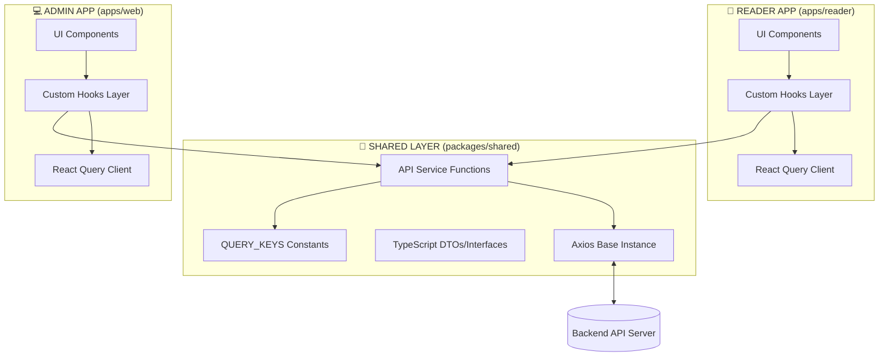

# 🎨 DESIGN: Unified React Query Architecture

**Date**: 2026-04-25
**Scope**: `apps/reader`, `apps/web`, `packages/shared`
**Architect**: Minh (Antigravity Solution Designer)

---

## 1. Overview
This document outlines the architectural design for integrating **TanStack Query (React Query)** as the centralized state management and data fetching layer for the Library Management System monorepo. 

The goal is to move away from fragmented `useEffect` based fetching and consolidate all API interaction logic into a **Shared Logic Layer**.

---

## 2. System Architecture



---

## 3. Data Storage Design (Query Keys)

We will use a hierarchical Query Key structure to allow for granular cache invalidation.

| Entity | Key Structure | Description |
|--------|---------------|-------------|
| **Books** | `['books']`, `['books', id]`, `['books', { filter }]` | Global book list and specific book details |
| **Users** | `['users']`, `['users', id]` | Admin-side user management |
| **Profile** | `['profile']` | Current logged-in user session data |
| **Borrows** | `['borrows']`, `['borrows', 'my']` | Lending records |
| **Notifications** | `['notifications']` | User alerts and system updates |

---

## 4. Shared Logic Layer Detail

### 4.1. Location: `packages/shared/src/services`
Fetcher functions will be standardized to return the raw data (after Axios interceptors handle the "Always 200" wrapper).

```typescript
// Example Pattern
export const bookService = {
  list: (params) => api.get('/books', { params }).then(res => res.data),
  get: (id) => api.get(`/books/${id}`).then(res => res.data),
};
```

// 🥈 Book Detail
export const useBookDetail = (id) => {
  return useQuery({
    queryKey: ["books", id],
    queryFn: () => bookService.get(id),
    enabled: !!id,
  });
};

// 🥉 My Borrowed
export const useMyBorrowed = () => {
  return useQuery({
    queryKey: ["borrows", "my"],
    queryFn: borrowService.getMyBorrowed,
  });
};

// 🏅 Notifications
export const useNotifications = () => {
  return useQuery({
    queryKey: ["notifications"],
    queryFn: notificationService.getAll,
  });
};
```

### 5.2. Mutation & Cache Invalidation
Actions that modify data must handle cache invalidation to ensure UI consistency.

```typescript
// Example: Mark as read
export const useMarkNotificationRead = () => {
  const queryClient = useQueryClient();
  return useMutation({
    mutationFn: notificationService.markAsRead,
    onSuccess: () => {
      // Automatically refresh the notifications list
      queryClient.invalidateQueries({ queryKey: ["notifications"] });
    },
  });
};
```

---

## 6. Caching & Sync Strategy

| Setting | Reader App (Client) | Admin App (Web) |
|---------|---------------------|-----------------|
| `staleTime` | 5 minutes (Prioritize speed) | 0 seconds (Prioritize accuracy) |
| `cacheTime` | 30 minutes | 15 minutes |
| `refetchOnWindowFocus` | false | true |
| `retry` | 2 times | 1 time |

---

## 6. Implementation Checklist (Acceptance Criteria)

### ✅ Infrastructure
- [ ] `@tanstack/react-query` installed in all relevant workspaces.
- [ ] `QueryClientProvider` wrapping the root of both apps.
- [ ] DevTools enabled in development mode.

### ✅ Code Quality
- [ ] Zero `useEffect` for data fetching in primary views.
- [ ] All Query Keys sourced from the shared constants.
- [ ] Type-safety ensured from Service to Hook.

### ✅ UX Improvements
- [ ] Skeletons show only on initial load; subsequent loads are instant via cache.
- [ ] Automatic re-syncing when performing mutations (e.g., adding a book).

---

*Created by AWF 2.1 - Solution Design Phase*
